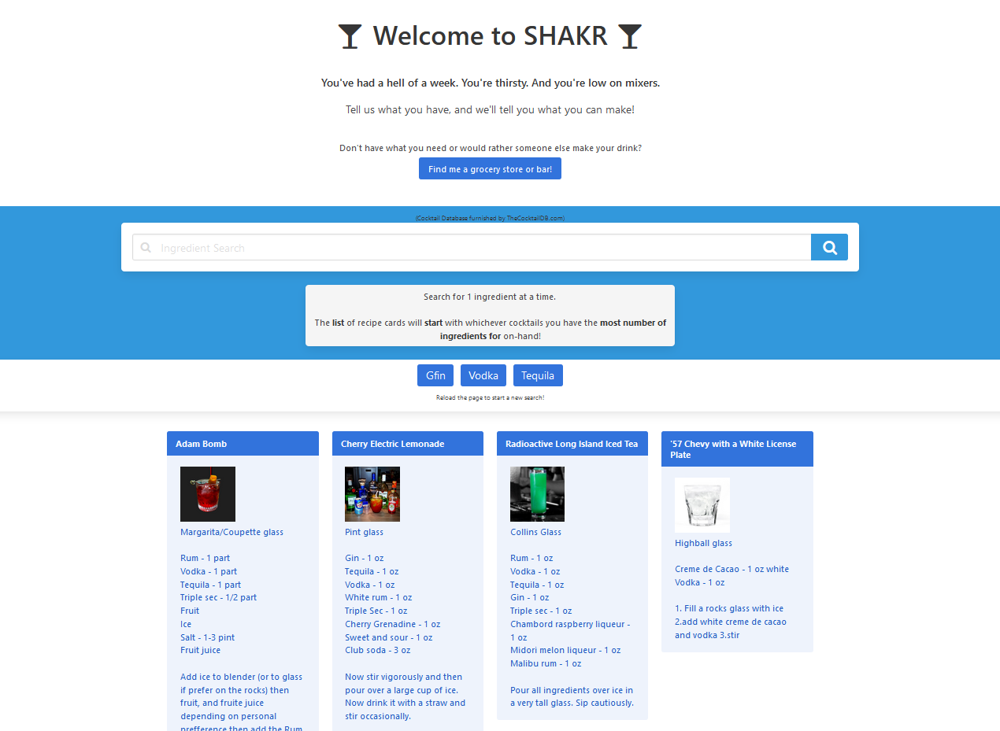

# UTA-FSF Project 1 - SHAKR App
 A cocktail generator web-app that uses theCocktailDB.com and Google Maps API to render cocktail recipes based on user-submitted ingredients on-hand.

### This repository contains the code files for the 1st project assignment for the UT-Austin Coding Bootcamp.

---

## Project Assignment
- Design, build, and deploy a client-side web application using GitHub Pages  
- Use third-party APIs to dynamically render an interactive web page  
- Practice applied agile software development, git branching work flow, and professional presentation  

## SHAKR
>AS a person who doesn't know which drink to make
>I WANT to know which mixed drinks I already have the ingredients for 
>SO THAT I can make a tasty beverage at home  

>AS an owner of random drink ingredients  
>I WANT to be shown detailed recipes and instructions  
>SO THAT I can succesfully make the drinks myself.  

>AS a person with nothing to drink at home  
>I WANT to be shown nearby bars and grocery stores  
>SO THAT I can imbibe beyond my at-home ingredient constraints  

---

## Link to Deployed Application

https://abraspin.github.io/Project-1-The-Silent-Marvels-/

---

## Example

---

## Contents
**Files include:**
* Index page
* Index JavaScript file
* Sample Screenshot of App 
* This README file

---

## Team
Chason Renz  
Jose Duran  
Ryan Rotman  
Abraham Spindel  

---

## Credits
* JQuery Library  
* Bulma.CSS Library  
* Font Awesome by Dave Gandy - https://fontawesome.io  
* theCocktailDB - https://thecocktailDB.com  
* Google Maps - https://cloud.google.com/maps-platform/
---

## Badges

---

## License
TheCocktailDB: Patreon Subscriber!  
JQuery: [MIT license](https://jquery.org/license/)   
Bulma.CSS copyright 2020 Jeremy Thomas. Code released under the [MIT license](https://github.com/jgthms/bulma/blob/master/LICENSE)    
Google Maps API  
